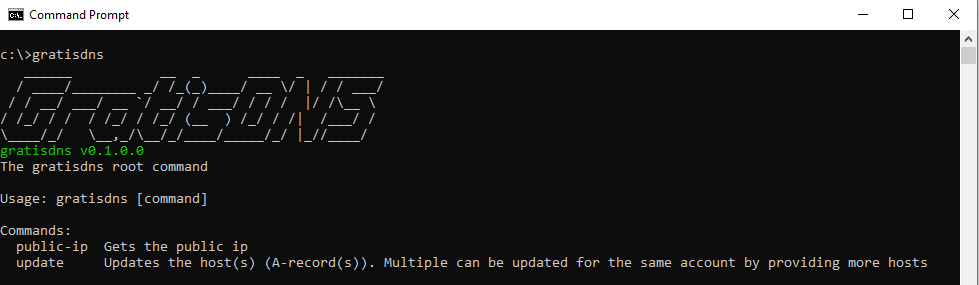
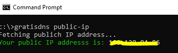
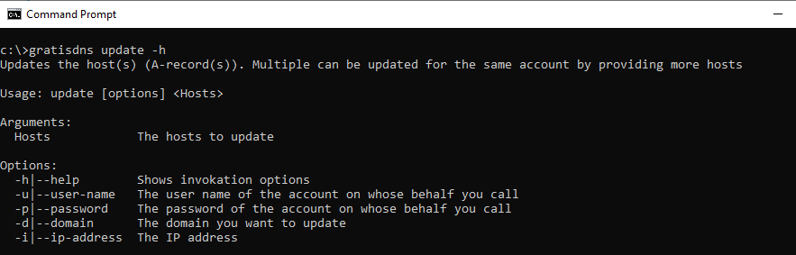
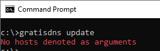
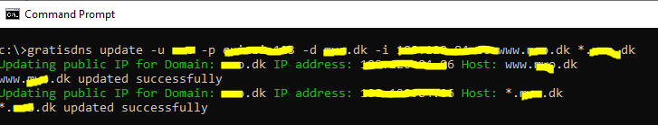
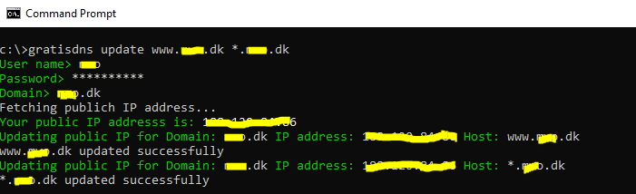

# gratisdns
Tools for managing DDNS the DNS service [gratisdns](https://web.gratisdns.dk/). The tools are:

1. A CLI based on [.Net Core 3.1](https://dotnet.microsoft.com/download/dotnet-core/3.1), that can:
    * Fetch your public ip in case you need it.
    * Update your host records providing you have domains registered with [gratisdns](https://web.gratisdns.dk/)
2. TODO: A simple long-running service (also requires [.Net Core 3.1](https://dotnet.microsoft.com/download/dotnet-core/3.1)), with a simple endpoint (you will be able to manage it via the CLI), where you can set up which hosts to update with which ip addresses. It can probe your public IP address, and then just update it when required.
3. TODO: A container (not done yet), that instead of providing installation of [.Net Core 3.1](https://dotnet.microsoft.com/download/dotnet-core/3.1), requires [docker](https://www.docker.com/). This container is a dockerization of the above.

## The CLI

As mentioned above the CLI is a very simple tool, that is written in [.Net Core 3.1](https://dotnet.microsoft.com/download/dotnet-core/3.1) - install the SDK. The tool is based on Nate McMasters [CommandLineUtils nuget package](https://www.nuget.org/packages/McMaster.Extensions.CommandLineUtils/), which is a great tool to write CLI's with nested sub-commands.

### Installation

The package is built and deployed on [nuget.org](https://www.nuget.org/packages/gratisdns-cli) and can be installed/updated simply via the dotnet CLI:

~~~
dotnet tool update -g gratisdns-cli
~~~

After this, the global dotnet tool command `gratisdns` should be available:

### Building yourself

You can of course choose to clone this repository and build it yourself by running the scripts build.bat or build.sh, depending on your platform (identical content with different file extensions).

### Fetching your public IP

Fetching your public IP is a simple manner of invoking `gratisdns public-ip`:

### Updating your hosts

Using the `update` sub-command is simple:

And as you can see, you can provide:

* The username via the -u or --user-name option
* The password via the -p or --password option
* The domain via the -d or --domain option
* The public ip via the -i or --ip-address option

You have to provide at least one host as the final argument, or else you get:

For each of the options, the following rules apply:

* For username, password and domain: If they are not provided, you will be prompted for them
* For IP address, it is fetched automatically

An example with everything provided could be:

Whereas just invoking with no options could be:

